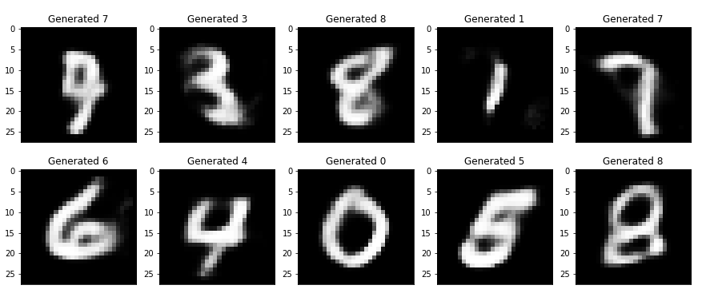

# Simple implementation of Conditional VAE

This my simple implementation of [Conditional Variational Autoencoder for Neural Machine Translation](https://arxiv.org/pdf/1812.04405.pdf) paper by Artidoro Pagnoni, Kevin Liu and Shangyan Li

## Requirements

The project is built on top of Pytorch 	`1.3.0`.
To install all requirement packages, run the command:
```bash
pip install -r requirements.txt
```

### Datasets

The model was taught on MNIST dataset, which can be obtained as:
```bash
torchvision.datasets.MNIST
```

## Results

For demonstration 10 random digits were generated
<p align="center"></p>